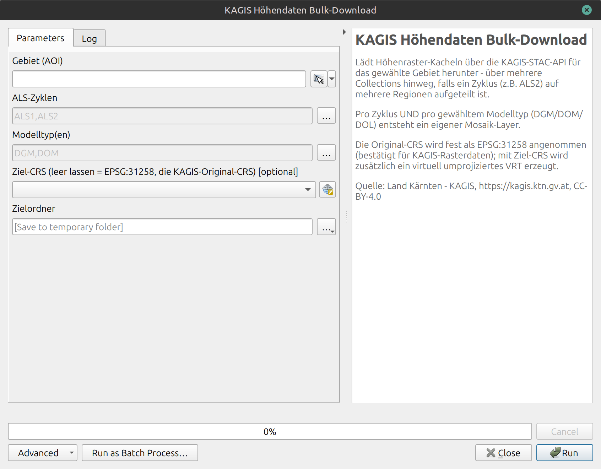

# KAGIS Höhendaten Bulk-Download

A QGIS Processing script that bulk-downloads elevation raster tiles (DGM/DOM/DOL, ALS1 & ALS2) from the official KAGIS (Land Kärnten, Austria) STAC API for a chosen area, and adds ready-to-use mosaic layers straight to your project.

> **Note:** The tool's interface (parameter labels, log messages, help text) is in German, matching its target audience and the German-language KAGIS data catalog it queries. This README is in English for discoverability.

## What it does

Given an area of interest, this tool:

- Queries the official KAGIS STAC API (`https://gis.ktn.gv.at/api/stac/v1/`) for elevation raster collections covering Carinthia (Kärnten), Austria.
- Automatically discovers and merges multiple regional collections when a survey cycle is split by region (ALS2 is split into Nockberge, Hohe Tauern, Gailtaler Alpen, and Kreuzeckgruppe).
- Downloads only the tiles that intersect your chosen area — not the whole collection.
- Lets you pick which elevation model type(s) to fetch — DGM (terrain model), DOM (surface model), DOL — each producing its own mosaic layer. With both ALS cycles and both DGM/DOM selected, you get 4 separate layers.
- Builds a lightweight VRT mosaic per cycle/model-type combination (no pixel duplication on disk) and adds it directly to your QGIS project, correctly tagged with the source CRS (EPSG:31258).
- Optional on-the-fly reprojection to a target CRS of your choice, via a standard CRS picker.
- Cancellable mid-run; failed downloads are retried once and reported in the log.

## Installation

This is a single-file **Processing script**, not a full plugin:

1. Download [`kagis_hoehendaten_bulk_download.py`](kagis_hoehendaten_bulk_download.py).
2. In QGIS: **Processing → Toolbox → Scripts (gear icon) → Add Script to Toolbox…**, and select the file.
3. It will appear under **Skripte/Scripts → KAGIS → KAGIS Höhendaten Bulk-Download**.

No extra Python packages required beyond what ships with QGIS (uses only the Python standard library plus the bundled GDAL/PyQGIS).

## Usage

| Parameter | Description |
|---|---|
| **Gebiet (AOI)** | Area of interest — draw a rectangle, use the current canvas extent or calculate extent from a layer |
| **ALS-Zyklen** | Which survey cycle(s) to fetch: ALS1, ALS2, or both |
| **Modelltyp(en)** | Which elevation model(s) to fetch: DGM, DOM, and/or DOL |
| **Ziel-CRS** | Optional. Leave empty to keep the source CRS (EPSG:31258); pick a CRS to get an additional, virtually reprojected VRT |
| **Zielordner** | Where downloaded tiles and mosaics are stored. It is recommended to use a persistent folder, not the default temp location — results should stay usable after the QGIS session ends, and a later run over an overlapping area reuses already-downloaded tiles instead of re-fetching them |

### Output layers

For every combination of selected ALS cycle × model type, one layer is added to the project (e.g. `ALS1_DGM`, `ALS2_DOM`), named after that combination. On disk, each combination gets its own subfolder under the chosen output folder, containing the original downloaded tiles plus a `..._mosaic.vrt` (and, if a target CRS was chosen, an additional reprojected VRT).

## Data source

Quelle: Land Kärnten – KAGIS, https://kagis.ktn.gv.at, CC-BY-4.0

## License

GPL-2.0-or-later — see [LICENSE](LICENSE). This follows QGIS's own licensing, since the script builds on the PyQGIS API.

## Credits

Written by Stephan Preinstorfer (LiberGIS) with help from Claude (Anthropic).

## Contributing

Issues and pull requests welcome.
